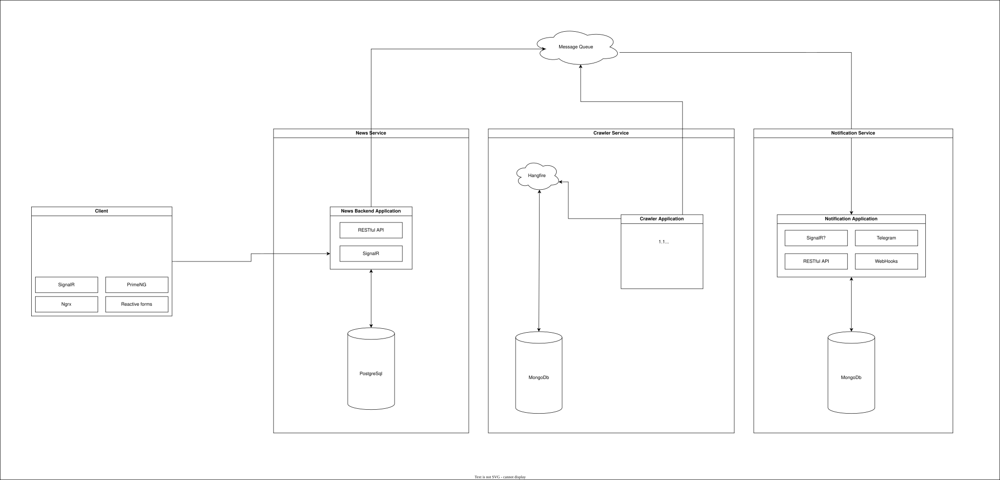

# News Service

## General description

This main goal of this service is to give access to aggregated news and its comments.
Also, it writes aggregated news from Schedule Service and sends events to Notification Service

## Stack:
1. ASP.Net
2. PostgreSQL
3. Message Queue

## API description

### Default pager parameters*

1. OrderBy
2. OrderDirection
3. Offset
4. Take

---

### NewsController

### `GET /api/v1/news`

Parameters:

1. Default pager parameters*
2. Keyword

Response:

```json
{
  "Id": "0",
  "Title": "Some title for current news",
  "Description": "",
  "OriginalLink": "https://news.com/some-id",
  "DateTime": "Thu, 03 Apr 2025 23:05:55 +0300",
  "ImageLink": "https://media.com/some-id",
  "Publisher": "Some News Publisher",
  "PublisherLink": "https://news.com/"
}
```

### CommentsController

### `GET /api/v1/news/{newsId}/comments`

Parameters:

1. newsId - Id of news
2. Default pager parameters*

Response:

```json
{
  "Id": "1",
  "Creator": "Somebody",
  "CreatorGuid": "gl12dD5v",
  "Content": "Some message",
  "Likes": 12,
  "Dislikes": 4
}
```

### `POST /api/v1/news/{newsId}/comments`

Parameters:

1. newsId - Id of news

Request:
```json
{
  "CreatorGuid": "gl12dD5v",
  "Content": "Some message"
}
```

### `PUT /api/v1/news/{newsId}/comments/{commentId}`

Parameters:

1. newsId - Id of news
2. commentId - Id of comment

Request:
```json
{
  "CreatorGuid": "gl12dD5v",
  "Content": "Some message"
}
```

### `PUT /api/v1/news/{newsId}/comments/{commentId}/like`

Parameters:

1. newsId - Id of news
2. commentId - Id of comment

Request:
```json
{
  "CreatorGuid": "gl12dD5v"
}
```

### `PUT /api/v1/news/{newsId}/comments/{commentId}/dislike`

Parameters:

1. newsId - Id of news
2. commentId - Id of comment

Request:
```json
{
  "CreatorGuid": "gl12dD5v"
}
```

### UserController
Invistigate and implement in future

---

# Crawler Service

## General description
Regularly sends requests to RSS sources, parses them and send to queue on write.

## Stack:
1. ASP.Net
2. MongoDb
3. Message Queue
4. Hangfire

---

# Notification Service

## General description
Notify users from events, that appears in queue. Can subscribe webhooks and, in the future, notify in telegram and by email.

## API description

### Default pager parameters*

1. OrderBy
2. OrderDirection
3. Offset
4. Take

### `GET /api/v1/webhooks`

Parameters:

1. Default pager parameters*

Response:

```json
{
  "GuidId": "ab12cd34",
  "WebhookUrl": "gl12dD5v",
  "EventType": "NewsUpdated",
  "DateStamp": "5/6/2005 09:34:42 PM"
}
```

### `POST /api/v1/webhooks`

Request:
```json
{
  "WebhookUrl": "http://webhook/some-webhook-id",
  "EventType": "NewsUpdated"
}
```

Response:

```json
{
  "GuidId": "ab12cd34",
  "WebhookUrl": "gl12dD5v",
  "EventType": "NewsUpdated",
  "DateStamp": "5/6/2005 09:34:42 PM"
}
```


## Stack:
1. ASP.Net
2. MongoDb
3. Message Queue
4. Hangfire